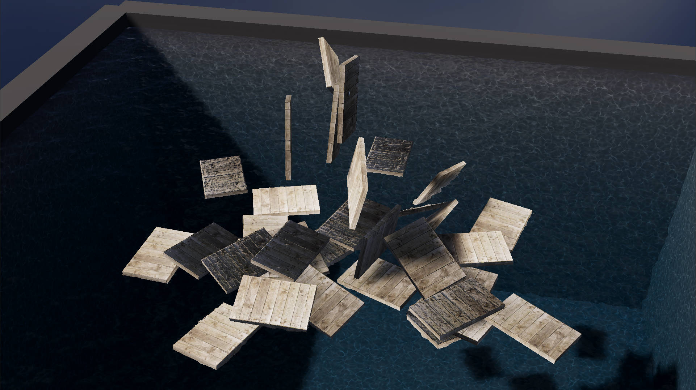

# Water Simulation 2024

This is a study of the real-time simulation of the buoyant behavior of submerged solid objects in fluid matter based on the Monte-Carlo method.
The study and the sample project is done by myself, Nianyi Wang;
the thesis is finished under the guidance of my teacher at Communication University, Honglei Han.

## File Structure

The sample project is stored in the `Water Simulation 2024/` directory; it is built with Unity 2022.3.16f1.

The source code of the thesis is stored in the `Thesis/` directory.
`cd` into the directory and run `make` to build the PDF document.
The built document could be found in `Thesis/Build/`.

## Acknowledgements

This is the first time I have ever written a serious academical article.
It is guaranteed that there will be naive mistakes all over the place.
Please excuse me, thou reader.
If thou hast spotted any mistake, please feel free to contact me via [email](wangnianyi2001@outlook.com).
My apologies in advance!

Thanks to the team of my graduation project, [Nani Core](https://github.com/nani-core).
The idea of this article rose when I was making the water system in the project.
They established the possibilty for this article to happen.
Special thanks to 陈恩晖 ([Omnisch](https://github.com/Omnisch)) and 张嘉玥 ([Limko](https://github.com/orgs/nani-core/people/lzjyim366)).
They are two really, really reliable co-workers and good friends of mine.
They have given me the greatest mental and physical support on the project, and an unforgetful memory in my graduation year.